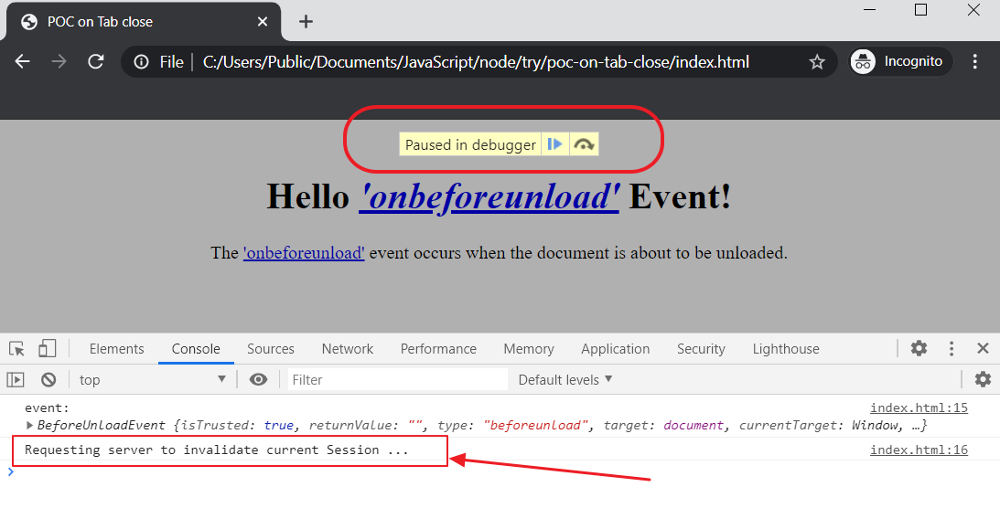

# POC: User Session Invalidation on Web Browser Window or Tab Close

## Requirements

The requirements is the following:

- The session management feature shall terminate (invalidate) the user backend session whenever the user closes the last web browser window or tab of the application **without explicitly logging out**.
- If the user opens the page again using URL, bookmark, or history in the browser, he/she should be redirected to the login screen. So, the user cannot re-open any page of the application without Login procedure.

## Solution

- Register JavaScript event handler for "close tab/window" JavaScript event (`beforeunload`)
- When the event intercepted, call server-side Logout API
    - Do not call Logout API if the user already explicitly signed out
    - Count opened tabs to call Logout API only when the **last** web browser window or tab of the application is closed

## POC steps to reproduce

### 1. Open `index.html` Page in a Web Browser

Open the `index.html` page in your web browser directly from the file system. You do not need any web service backend.

### 2. Put a breakpoint

### 3. Close the Web Browser Window or Tab

### 4. The event `beforeunload` is intercepted

### 4. The Running Script is Paused in Debugger

### 5. Resume Script Execution to Finally Close the Web Browser Window or Tab

